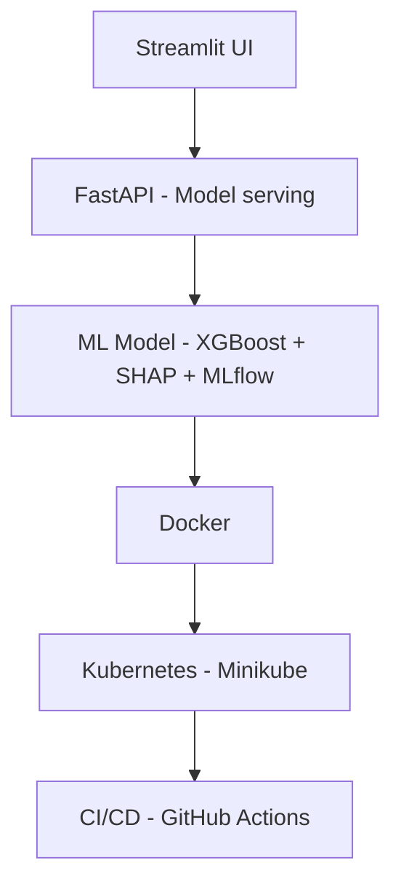

## 1. Projet Data Risk : Credit Risk Scoring with ML

> Credit risk scoring project with ML and MLOps.

### 1.1 Objective

> Predict customer default risk using Machine Learning models to support lending decisions.
>
>  "This project uses Machine Learning and deploy the model with a full MLops pipeline"
>
> the full workflow : User -> Streamlit -> FastAPI -> Model -> Prediction 

### 1.2 Architecture

## Architecture


  

### 1.3 Stack

- Python (pandas, sklearn, xgboost)
- SHAP (interpretability)
- FastAPI (model serving)
- MLflow (tracking model)
- Streamlit (frontend)
- Docker (containerization)
- Kubernetes (deployment)
- Github Actions (CI/CD)

### 1.4 Features

- Credit risk prediction
- Explainability with SHAP
- REST API
- Interactive dashboard
- CI/CD pipeline
- Kubernetes deployment

### 1.5 run locally

- `src/data_preprocessing` : preprocessing
- `src/train.py` : training et tracking MLflow
- `src/evaluate.py` : evaluation et graphics generation

> How to run the project :
```bash
python src/data_preprocessing.py
python src/train.py
python src/evaluate.py
python src/explain.py

</> Bash
mlflow ui -> running mlflow app
uvicorn api.app:app --reload  && then http://127.0.0.1:8000/docs -> running the serving app

streamlit run streamlit_app.py -> to run streamlit app

docker build -t credit-risk-api . -> to build docker image
docker run -p 8000:8000 credit-risk-api -> to run docker image

http://localhost:8000/docs -> to show the Swagger doc 


### 1.6 Set up
```bash
python -m venv venv
source venv/bin/activate
pip install -r requirements.txt
```
### 1.7 CI/CD

This projet uuses Github Actions to:
- run tests
- train and evaluate the model
- generate SHAP reports
- build the Docker image
- deploy the API to a temporary Minikube Kuberntes cluster on Azure
- validate the '/health' endpoint

This avoids clouds costs while demonstrating a complete kubernetes CI/CD worflow.

### 1.8 Documentation and description

> I have used severals steps to thrive into the project by handling it throughout many ways. Follow this link: [credit-risk-ml](https://github.com/Arnaudguetch/credit-risk-ml/projects?query=is%3Aopen) to see the project name and then click on it to see the view of the plan, insights that show the issues opened and closed.

> The whole project is documented and detailled through this link: [Here!](https://github.com/Arnaudguetch/credit-risk-ml/wiki/Credit%E2%80%90Risk%E2%80%90Scoring)

